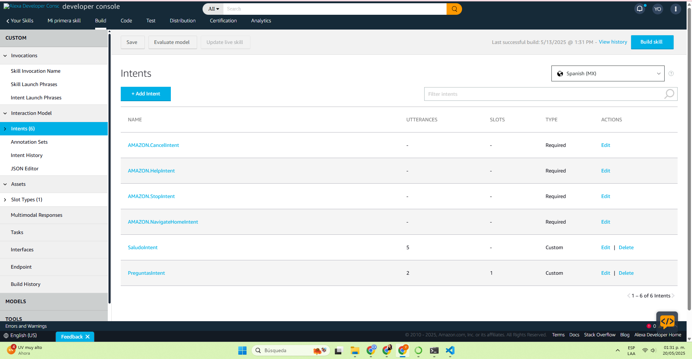
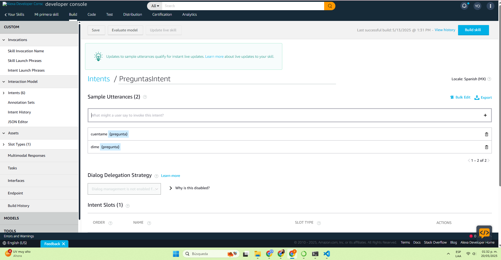
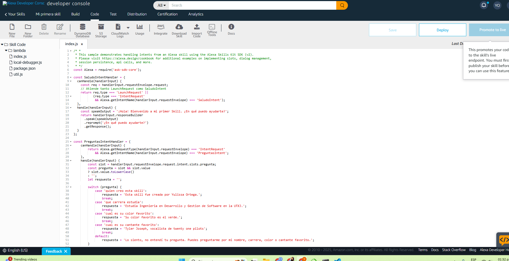

  
# ECBD_Practica03_220875

**UNIVERSIDAD TECNOLÓGICA DE XICOTEPEC DE JUÁREZ**  
**Materia:** Extracción de Conocimiento en Bases de Datos  
**Matrícula:** 220875 
**Nombre de la práctica:** Interacción por comandos de voz con Alexa

---

## 📝 Resumen de la práctica

En esta actividad se retomó una skill previamente creada en Alexa y se actualizó para incluir nuevas funcionalidades. El objetivo fue permitir que el asistente respondiera preguntas personales relacionadas con el desarrollador. Para lograrlo, se utilizaron las herramientas del Alexa Skills Kit (ASK), añadiendo nuevos intents y respuestas estáticas que fueron programadas, desplegadas y probadas.

---

## 🛠️ Funcionalidades implementadas

### ✨ Inclusión del intent para las preguntas

Se añadió el intent: PreguntasIntent, la cual responde lo siguiente:

- **¿Quién creo la aplicación**
- **¿Qué carrera estudia?**
- **¿Cuál es su color favorito?**
- **¿Cuál es su cantante favorito?**

---

### 🗣️ Frases de activación (Utterances)

- **cuentame** {pregunta}

---

### 💬 Respuestas programadas

Cada intent devuelve una respuesta fija y específica. Ejemplos:

- "Esta skill fue creada por Yulissa Ortega Cuevas"
- "Estudia Ingenieria en Desarrollo y Gestión de Software."
- "Su color favorito es el verde."
- "Tyler Joseph, vocalista de Twenty one pilots."

---

### ☁️ Despliegue en consola de Alexa

La skill fue desplegada usando la [Alexa Developer Console](https://developer.amazon.com/alexa/console/ask), asegurando que estuviera lista para recibir comandos y responder correctamente.

---

### ✅ Pruebas funcionales

Se realizaron pruebas desde la consola para verificar que las frases de activación funcionaran y que Alexa respondiera adecuadamente a cada una.

---

## 📸 Evidencias
### 🔧 Creación del Intent

### 🔧 Utterances

### 💻 Código fuente

### 🧪 Pruebas realizadas

